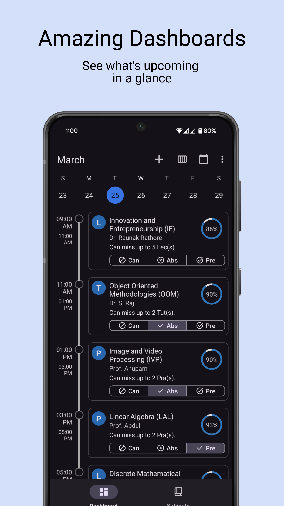
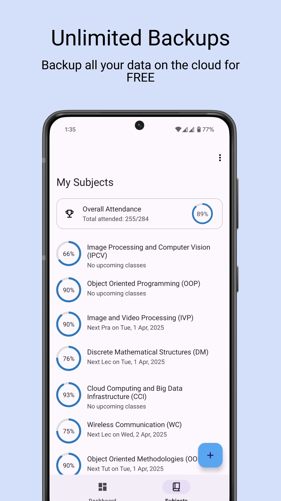

# SilverBook: Attendance Tracker

**Effortless Attendance Management for College Students**

**SilverBook** is your go-to **attendance tracking app** designed to simplify managing your college attendance. With features like a daily dashboard, one-tap notifications, comprehensive attendance management, and secure cloud backup, SilverBook ensures you stay organized and never miss a class.

## Key Features

**Daily Dashboard**  
Quickly check your schedule and keep track of your day.  

**One-Tap Notifications**  
Mark attendance and join online meetings with just one tap.  

**Comprehensive Management**  
Track attendance across all subjects, with detailed information about required attendance.  

**Secure Cloud Backup**  
Your data is safely stored in the cloud, ensuring you never lose your records.  

**Timetable Sharing**  
Share your classes and timetable with friends.  

## Getting Started

**Download SilverBook today** and take control of your college attendance.

[Download SilverBook from the Play Store](https://play.google.com/store/apps/details?id=com.kinshuu.silverbook)

Or scan the QR code below to download the app directly:

## Support

For any questions or support, please reach out to us at [silverbook.assistance@gmail.com](mailto:silverbook.assistance@gmail.com).
